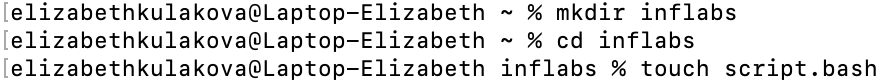
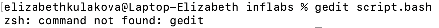
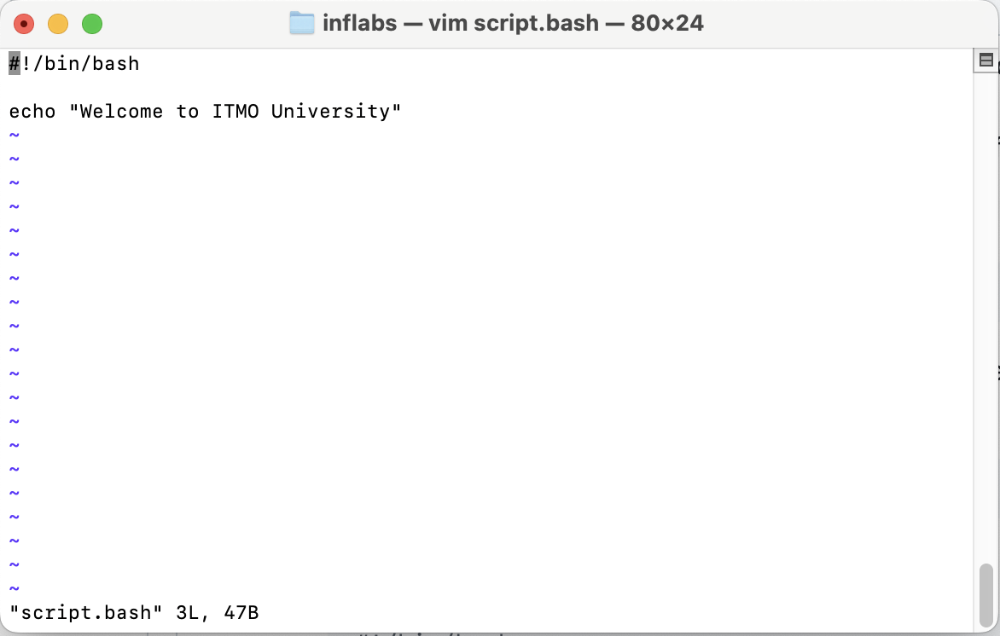
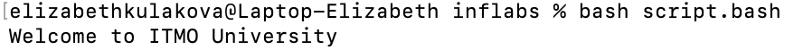

## Лабораторная работа 1

### часть 1

Я работала на MacOS, поэтому некоторые команды пришлось заменить на те, что поддерживаются на моем ноутбуке. Это будет рассмотрено в ходе лабораторной работы.

1. Создала новый директорию `inflabs`, а в ней – файл с именем `script.bash`. Чтобы создать файл в директории, использовала команду cd

```bash
mkdir inflabs
cd inflabs
touch script.bash
```
<p align="center">
 
</p>

2. Открыла созданный файл `script.bash` для редактирования. Выполнила в терминале

```bash
gedit script.bash
```
однако терминал выдал ошибку:

```bash
zsh: command not found: gedit
```
<p align="center">
 
</p>

поэтому я использовала **графический редактор `vim`**, который поддерживает MacOS, и скрипт выполнился успешно:

```bash
vim script.bash
```
<p align="center">
 
</p>

3. Для редактирования нажала клавишу `i`. Вписала следующий скрипт:

```bash
#!/bin/bash

echo "Welcome to ITMO University"
```
<p align="center">
 
</p>

4. Вышла из режима редактирования и сохранила файл: `esc` > `:w`+`Enter`. Закрыла текстовый редактор `vim`, выполнив следующую комбинацию: `:q`+`Enter`. Запустила bash-скрипт, выполнив в терминале

```bash
bash script.bash
```
<p align="center">
 
</p>

5. В терминале отобразилась строка `Welcome to ITMO University`.
